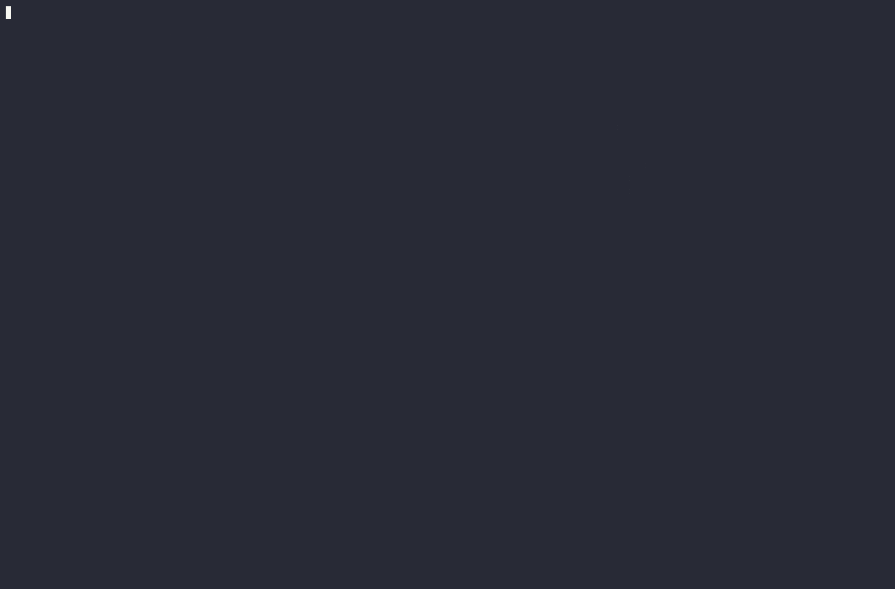
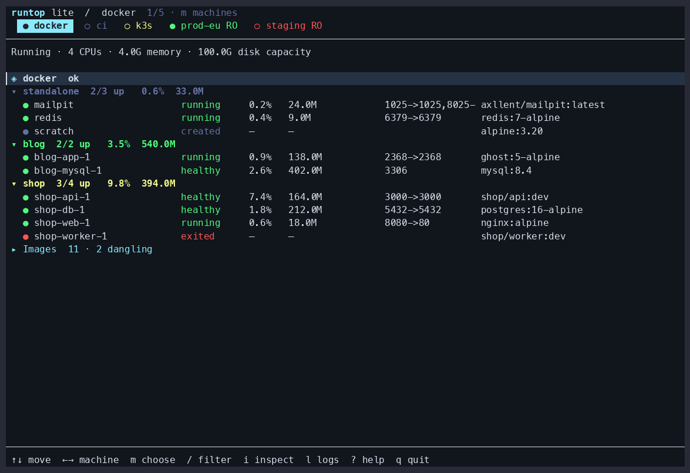
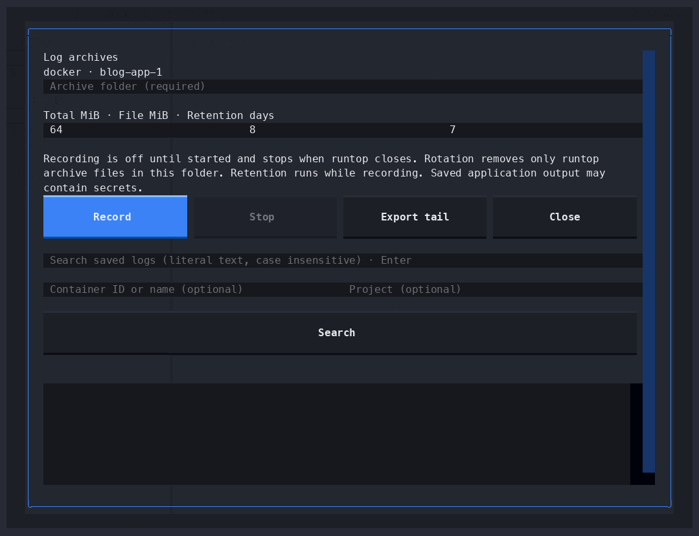

<h1>
  <picture>
    <source media="(prefers-color-scheme: dark)" srcset="assets/brand/logo-on-dark.svg">
    
  </picture>
</h1>

A terminal workspace for containers and their machines.
MIT licensed for personal and commercial use.



Choose the **full edition** for a machines sidebar, grouped containers, an inspector,
project logs, archive recording, search, and mouse-driven workspace controls.
Choose **lite** for a compact screen, fast startup, and a small standalone executable.
Both editions work with existing local engines and read-only remote contexts.

Documentation is available [online](https://bcivitcioglu.github.io/runtop/) and
inside either edition: `runtop docs`, `rt docs agents`, or `runtop docs --json`.

## Install

For installation without a compiler, follow the [guided installer](docs/INSTALL.md).
It handles edition selection, updates and full-edition dependencies.

Full edition, requiring Python 3.11 or later:

```sh
uv tool install 'runtop>=0.1.2'
runtop --demo
```

Lite edition:

```sh
cargo install --locked runtop
rt --demo
```

Prebuilt lite executables are attached to the repository’s releases. Extract the
archive, verify its checksum, and place `rt` and `runtop` on your executable path.

`rt` always opens lite. When both editions are installed in separate executable
locations on your path, `runtop` opens full. The lite launcher recognizes the full
entry point and hands over the original arguments. `rt` remains the direct route
to lite. `--version` and `--edition` identify the executable you are running.

## Full workspace

- Choose **Containers** or **Images** using the boxed view selector above Machines.
  The view applies to the selected machine; VMs stay in Machines. Use `←→` on the
  selector, then Enter to browse its contents.
- Browse machines and containers grouped by project. `/` filters; `attention`
  finds unhealthy, restarting, dead, and failed containers.
- Inspect ports, mounts, networks, restart counts, memory failures, and health
  output. `1`, `2`, `3` select Info, Logs, and Stats; `i` opens narrow-mode details.
- Select a project and press `l` for combined logs. `s`, `x`, `R` start, stop, or
  restart the listed existing members after a preview. Filters limit membership.
- `D` opens storage accounting on demand. Shared layers, unknown usage, and
  machine capacity are presented separately.
- `ctrl+p` opens the command palette; `?` lists keys. Use the mouse to navigate,
  select tabs, and resize panes. `t` changes theme.

## Lite workspace



A visible machine strip, one grouped list, and one footer. The active machine
stays highlighted as you switch. Columns adapt to terminal width. Container statistics and project totals remain close to their rows.

- `↑↓` / `jk` move; `←→` / `[` / `]` switch machines; Space folds a section.
- `m` opens the machine chooser with names and status. Enter switches; Esc cancels.
  You can also click a machine in the strip.
- `/` filters, `o` sorts by name, CPU, or memory, and `r` refreshes.
- `i` inspects, `l` opens container or project logs, and `D` shows storage.
- `s`, `x`, `R`, `X` start, stop, restart, or remove selected containers; actions
  preview the captured selection and require confirmation.
- `e` opens a shell; `p` previews dangling-image pruning; `?` shows all keys.
- In logs, `f` toggles following, `w` wraps, and Esc returns to the list.
- `--read-only` disables all mutations. `--no-mouse` disables mouse capture.

Lite keeps at most 2,000 log lines and 2 MiB of log text, and follows at most 64
selected sources. Archive recording, export, and archive search belong to full.

## Listings and diagnostics

See the [CLI reference](docs/CLI.md) for all commands, options, edition differences,
JSON output and exit codes. `runtop ps --help` and `runtop logs --help` show command help.

```sh
runtop ps -a --json
rt ps -a --stats
rt ps --images
runtop --doctor
rt --doctor
runtop --dump lima:docker
```

`ps` lists local targets by default. Add `--contexts` to include remote targets,
or select one explicitly with `--target KEY`. `--json` uses the shared
[snapshot contract](spec/SPEC.md). Exit codes are 0 for success, 1 for no targets
or a discovery failure, 2 for invalid input, and 3 for unavailable or partial data.

Failed interactive refreshes retain the last successful data with a stale warning
and disable actions. Image-list failures leave containers usable. Remote contexts
are always read-only. No engine is installed and no machine is created on startup.

## Record and search logs



In full, `L` opens Log archives for the selected container or project. Choose a
folder and limits, then press **Record**. **Stop** ends capture. Closing the
controls keeps recording active until the app exits; an indicator stays visible.
**Export tail** saves recent output without following.

```sh
runtop logs record --target lima:docker --project shop --directory ~/logs/shop \
  --max-mib 64 --file-mib 8 --keep-days 7
runtop logs export --target lima:docker --container api --directory ~/logs/api --tail 500
runtop logs search error -i --directory ~/logs/shop --limit 200 --json
runtop logs status --directory ~/logs/shop --json
```

Recording is off by default. Defaults are 64 MiB total, 8 MiB per file, and seven
days retention. Rotation removes only owned archive files; one writer may use a
folder at a time. Search streams saved files with bounded results. Exit codes
are 0 for matches, 1 for none, and 2 for invalid input or an archive error.

Archives retain capture time, source identity, output stream, message, and
truncation markers. `--since` filters capture time. Queue or disk errors stop
capture visibly. Recording follows existing container IDs and does not reconnect
across their recreation. Saved output may contain application secrets.

## Resource use

On a 24-container fixture, lite 0.1.1 displayed its first data frame in 13 ms and
used 8.3 MiB of steady process memory; full displayed data in 325 ms and used
69.6 MiB. These are medians of five warm-cache runs on one ARM64 machine, excluding
engine I/O and terminal rendering. See [raw results, reproducible commands and
measurement limits](docs/PERFORMANCE.md), including a separate sustained-log test.

## Develop

```sh
uv sync --locked
uv run ruff check
uv run ty check --error-on-warning
uv run pytest
cargo fmt --check
cargo clippy --locked --all-targets -- -D warnings
cargo test --locked
cargo build --locked --release
```

Both editions share normalization fixtures. Interface recordings use synthetic
`--demo` data. Local runtime workloads and development measurements are kept
outside distributed packages.
